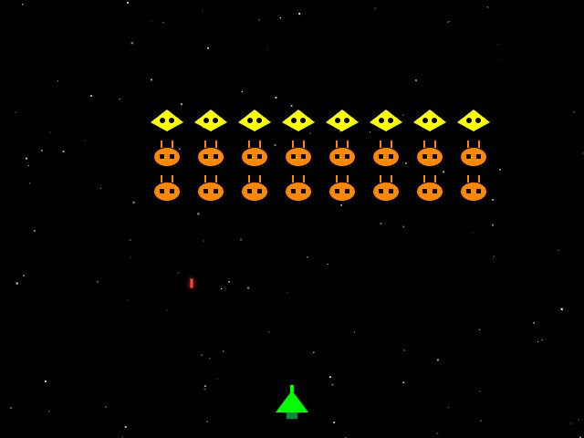

# Space Invaders

A lightweight browser game built with vanilla HTML, CSS, and JavaScript. The project recreates the classic Space Invaders loop with animated enemy waves, score tracking, lives, and level progression.



## Overview

This repository contains a playable arcade-style Space Invaders game that runs directly in the browser without any frontend framework or build step. It also includes a small Python script that uses the Claude Agent SDK to generate the game files programmatically.

## Features

- Canvas-based gameplay with responsive keyboard controls
- Score, lives, and level tracking
- Multiple invader types with different point values
- Particle explosions and animated starfield background
- Restartable game loop with increasing difficulty

## Tech Stack

- HTML5
- CSS3
- Vanilla JavaScript
- Python 3.13
- Claude Agent SDK

## Project Structure

```text
.
├── index.html
├── style.css
├── script.js
├── main.py
├── pyproject.toml
└── assets/
    └── space-invaders-preview.jpg
```

## Run Locally

### Play the game

Open `index.html` in a browser, or serve the folder locally:

```bash
python3 -m http.server 8000
```

Then visit `http://127.0.0.1:8000/index.html`.

### Run the generator script

If you want to run the Python script that uses the Claude Agent SDK:

```bash
uv run main.py
```

Make sure your local `.env` file contains `ANTHROPIC_API_KEY` before running it.

## Controls

- `Left Arrow` or `A`: Move left
- `Right Arrow` or `D`: Move right
- `Space`: Shoot

## Notes

The `.env` file is intentionally excluded from version control. Only the application code and static assets are committed.